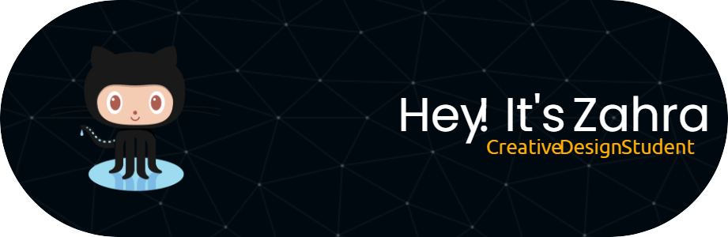

# Introduction
Hi! I'm Zahra Fathanah, a student in the Framework-Based Software Design and Development course. 
I aim to explore more tools I can use to develop a system and gain hands-on experience in building fully functional websites or applications

  <!-- Link to the uploaded image -->

- **Fun fact**: I love to watch movies on Saturday Night and like to design when I am bored.
- **Course expectations**: To gain hands-on experience in designing, developing, and maintaining software by using many languages (not just HTML and their friends).

## GitHub Profile

You can view my personalized GitHub profile [here](https://github.com/zfathanah)

